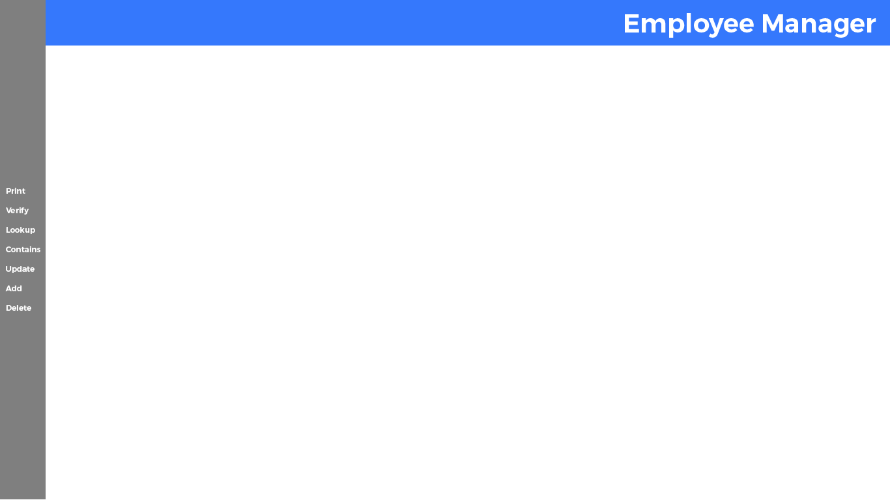
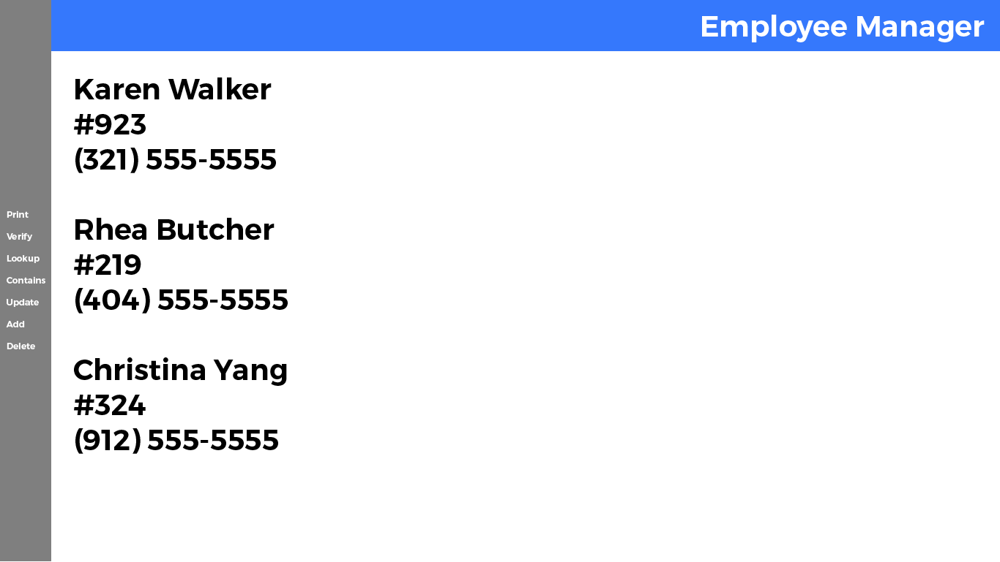
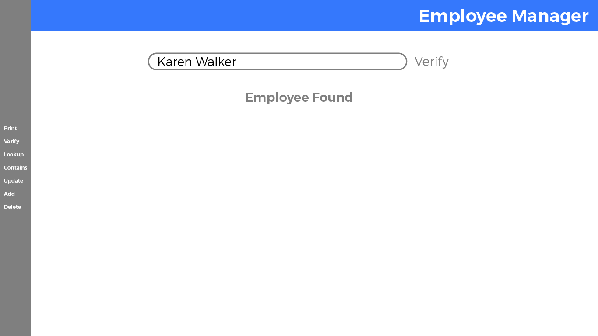
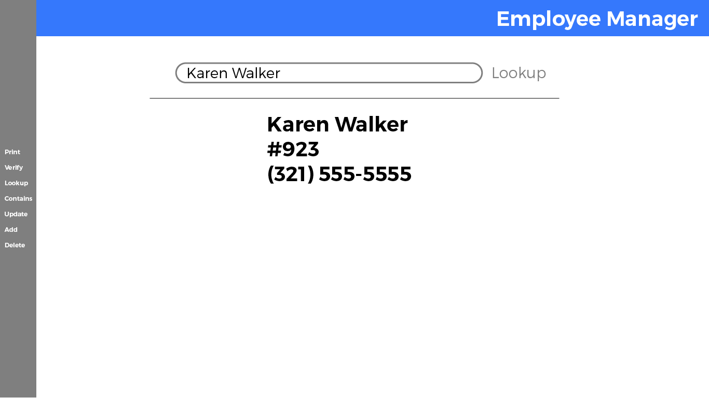
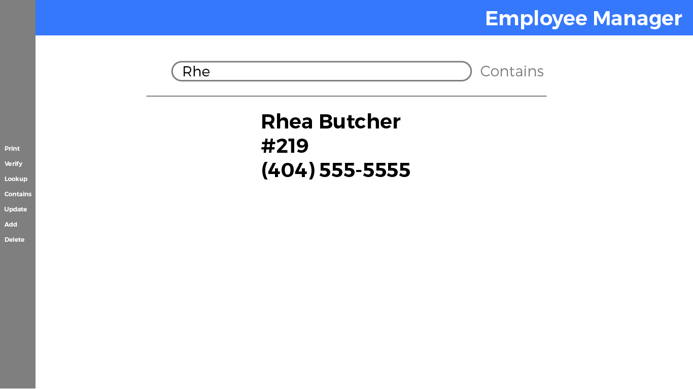
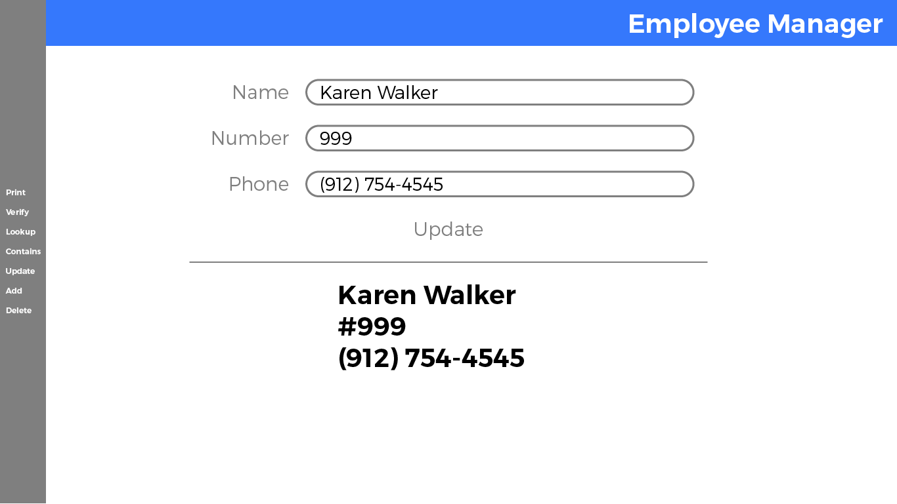
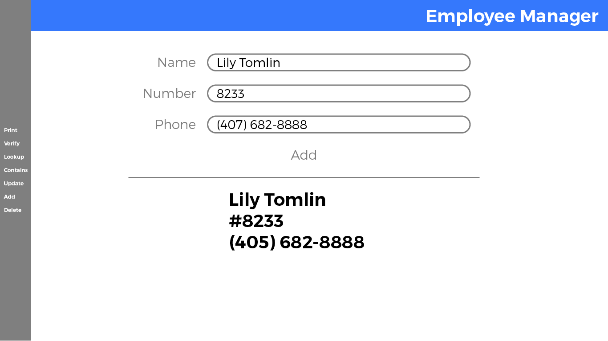
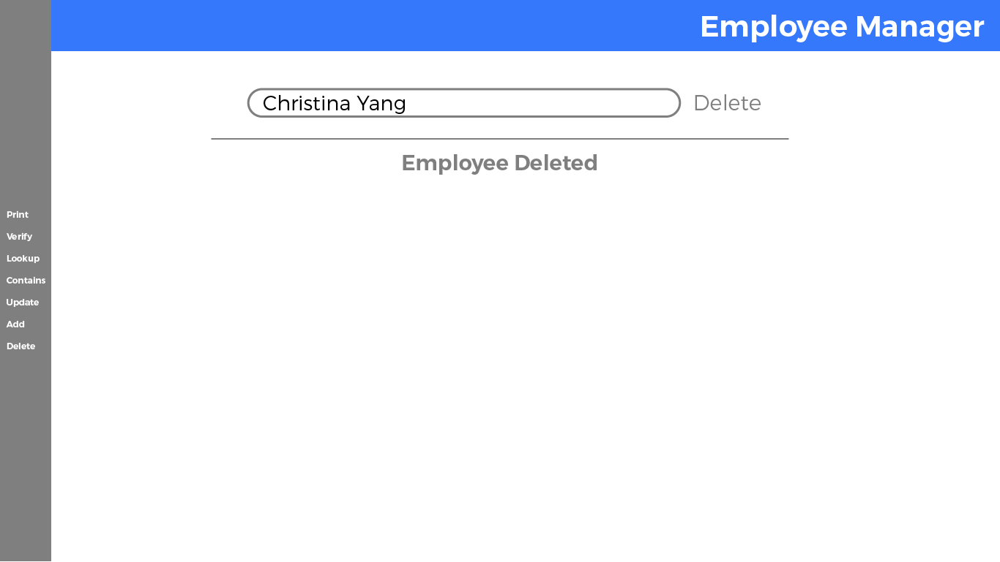

# Homework 4 - UI for Employee List and Reading

There are **2 parts** to this homework. The homework is only complete if **all** parts are submitted.

Homework is only incomplete if 1 or more parts are not submitted. Non-working code is **not** an incomplete. Please turn in any code you have. 

**This homework is due Tuesday September 11st at 5pm.** Late submissions are not accepted.

## Part 1: UI for Employee List

For the main part of this week's homework, you're going to be using DOM manipulation to expand on last week's homework.

**Build for desktop only. Design will be part of the next phase.** 

This is a single-page application. Everything on the page will be loaded dynamically to a single page using the DOM library we've been building in class.

You'll start at the home page view. When someone selects one of the navigation items (`Print`, `Verify`, `Lookup`, `Contains`, `Update`, `Add`, and `Delete`), you'll first load the input fields. Once the user has entered the data in the input field and selected the action button, you'll then dynamically load either a notice (something like `Employee Found`) or employee data.

When a new navigation option is selected, you'll need to hide whatever is on the page and then display the new input fields for the new page.

### Home Page

### Print Option

If the option selected is `Print`, display all the employee names, office numbers, and telephone numbers on the page.

### Verify Option

If the option selected is `Verify`, display an input box to get the employee name. There should be a `Verify` button. When the `Verify` button is clicked, if the employee name is found, display `Employee Found`. If the employee is not found, display `Employee Not Found`.

### Lookup Option

If the option selected is `Lookup`, display an input box to get the employee name. There should be a `Lookup` button. When the `Lookup` button is clicked, display the employee information. If the employee is not found, display `Employee Not Found`.

### Contains Option

If the option selected is `Contains`, display an input box to get a partial employee name. There should be a `Contains` button. When the `Contains` button is clicked, display any employees' information that matches the partial name. If no employees are found, display `Employees Not Found`.

### Update Option

If the option selected is `Update`, display an input box to get the employee name, office number, and phone number. There should be an `Update` button. When the `Update` button is clicked, display the employee's new updated information. If no employee was found, display `Employee Not Found`.

### Add Option

If the option selected is `Add`, display an input box to get the employee name, office number, and phone number. There should be an `Add` button. When the `Add` button is clicked, display the new employee's information.

### Delete Option

If the option selected is `Delete`, display an input box to get the employee name. There should be a `Delete` button. When the `Delete` button is clicked, `Employee Deleted` if the employee was found and successfully deleted. If the employee was not found, display `Employee Not Found`.

---

## Part 2: JavaScript Best Practices Reading

Read the following article: [JavaScript Best Practices: Part 1](https://www.thinkful.com/learn/javascript-best-practices-1/)

* You may need to read the article several times to fully understand it. 

* You may need to Google concepts that you don't fully understand. 

* When you fully understand the article, write a synopsis as though you are explaining the concepts to a ten year old. 

* Your summary must be at least 150 words.

* Your summary must include one analogy. Example "A conditional is like a fork in the road. You go one way if you want to go home and another if you want to go to work."